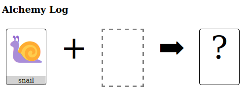
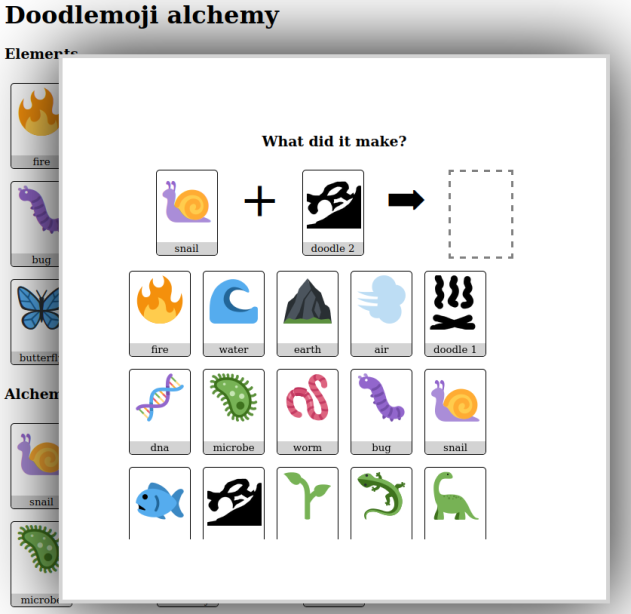
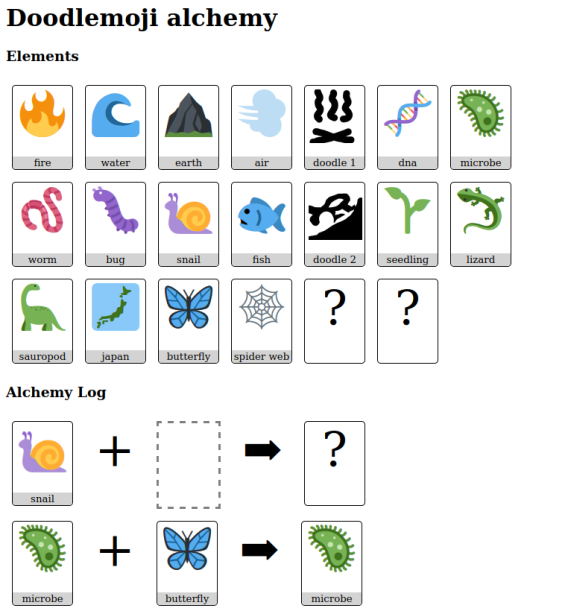

## Doodlemoji Alchemy

This is a small alchemy game. Play it [here](https://za3k.github.io/ha3k-07-doodle-alchemy/).

You combine elements to make something new. Sometimes you get an old element:

Sometimes you discover a new one!

Doodlemoji Alchemy was made in one day by za3k and Jennifer, as part of [Hack-A-Day](https://za3k.com/hackaday)
